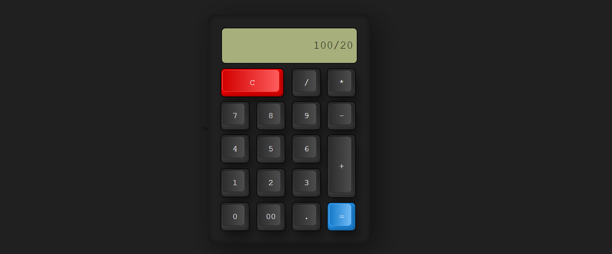

# PHP - Calculadora (formulari)
## DAW-MP07-UF1 - Exercici de Desenvolupament web en entorn servidor.
En aquest exercici programarem una calculadora amb **HTML**, **CSS** i **PHP**. Caldrà programar les diferents funcionalitats d'aquesta.
 
>Atenció: Aquesta solució és purament acadèmica. En aplicacions professionals no tindria sentit resoldre el problema proposat a la banda del servidor.
 
Caldrà utilitzar el mètode **$_POST** per a recollir i processar les dades. Cal parar especial atenció a la llegibilitat del codi i usar funcions sempre que sigui possible.
 

 
Utilitza els fitxers [index.php](index.php) i [style.css](style.css) com a base per al teu treball. Implementa la teva solució al fitxer **index.php**.
Segurament caldrà modificar el codi **HTML** per a rebre la informació correctament.
 
Assegura't que la calculadora sempre funcioni, mostra **ERROR** en la sintaxi impossible i **INF** quan toqui.
 
Només s'ha de mostrar quatre decimals com a resultat dels números amb fracció decimal.
 
### Un cop fet
 
Afegeix els botons de parèntesi **( )**, **SIN** i **COS**. Implementa la seva funcionalitat.
 

 
### A més a més (Extra)
 
Minimitza els errors de l'usuari dotant de certa intel·ligència a la calculadora. Per exemple:
+ Neteja els resultats quan s'introdueix un nou nombre després de l'igual.
+ Permet avaluar resultats on hi hagi parèntesis no tancats.
+ Al prémer **SIN** o **COS** s'encapsula el resultat, exceptuant aquelles operacions on té sentit introduir-ho a continuació.
+ Després de  **SIN** o **COS** no encapsulat obre el parèntesi automàticament.
+ Afegeix l'operació multiplicar allà on manqui. Per exemple: **(9)9** ha d'esdevenir **(9)\*9**.
+ ...
 
 
 
---
###### Autor: Aniol Lidon 2022.09.27
###### [CC BY](https://creativecommons.org/licenses/by/4.0/) 

