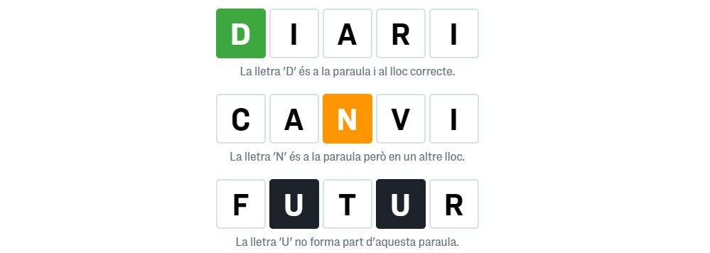

# PHP - Trobamot - Joc amb formularis i sessions (REC)
## DAW-MP07-UF1 - Exercici de Desenvolupament web en entorn servidor.
Crea un joc Wordle en PHP similar al [joc del trobamot](https://jocs.ara.cat/trobamot/) de paraules en català, prenent com exemple el joc del diari ARA.

**Intruccions del joc:**

1. El Wordle és un joc de paraules en línia en què l'objectiu és endevinar una paraula secreta de cinc lletres en el menor nombre d'intents possible. Hi ha un màxim de sis intents per encertar-la.

1. Per cada intent, el jugador que intenta endevinar la paraula fa una proposta de paraula. El joc mostrarà quines lletres de la paraula són correctes i estan en la posició correcta (de color verd), quines lletres són correctes però estan en la posició incorrecta (de color groc) i quines no formen part de la paraula (color negre). 
1. Amb aquesta informació, el jugador que intenta endevinar la paraula haurà de fer una nova proposta que prengui en consideració les lletres correctes i la seva posició.
1. El joc acaba quan el jugador que intenta endevinar la paraula aconsegueix endevinar la paraula secreta o es queda sense intents.

**Guia:**

1. A partir dels fitxers `index.php` i `style.css` dona-li al joc funcionalitat. De manera que les solucions no siguin visibles per l'usuari.
    + No poden aparèixer errors o warnings de PHP.
    + No hi ha d'haver funcionalitat repetida.
1. Cal convertir el codi HTML per enviar el text introduït en forma de POST.
1. Cal utilitzar el patró PGR en la implementació tal com vam veure al [següent exercici](/activitats/DAW-MP07/DAW-MP07-UF1/php-el-patro-pgr-postredirectget).
    + Crea el fitxer `process.php` i usa'l per calcular les solucions.
1. S'ha de fer ús de sessions per tal de mantenir l'estat actual del joc durant tot el dia.
1. La solució s'ha de generar automàticament quan la sessió no estigui activa i aquesta ha de dependre de la data d'avui. 
    + Cada dia a les 12 de la nit s'esborraran les respostes i es generarà una nova solució.
    + La paraula a endeviniar cada dia és diferent. Dona un cop d'ull a la funció [srand](https://www.php.net/manual/en/function.srand.php).
1. Cal afegir els mètodes GET: `data`, `sol`, `neteja`. Per generar la data d'un joc diferent del d'avui, mostrar les solucions, i per netejar les respostes.
1. Cal mostrar els següents errors:
    + Paraula no trobada.
    + Hi falten lletres.
1. Cal fer desplegament a la màquina Isard. El codi estarà disponible a `/var/www/html/phpmotUF1`.

---

#FpInfor #Daw #DawMp07 #DawMp07Uf01

---

###### Autor: Aniol Lidon Baulida 2022.10.10
###### [CC BY](https://creativecommons.org/licenses/by/4.0/) 

