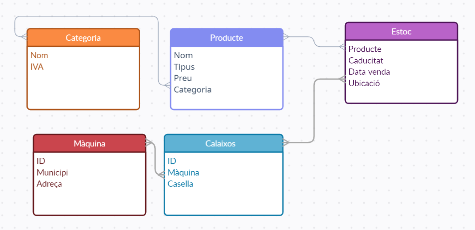

# Node - Màquines expenedores
## DAW-MP07-UF2 - Exercici de Generació dinàmica de pàgines web.
**Objectiu**: Confeccionar una API per l'aplicació que gestiona l'estoc de màquines expenedores.
Una empresa té una sèrie de màquines repartides per diversos municipis. Les diferents màquines tenen diferents calaixos on hi ha un producte. Dels productes en tindrem diferents unitats que en direm estocs.



Les diferents aplicacions que controlen aquest sistema s'han de poder comunicar, per això crearem una API que ens permeti des de controlar els productes que tenim, saber-los situar a les diferents màquines i poder-ne treure informació.

Tenim molt pocs dies per implementar un primer prototipus que aviat se'n farà ús i, per tant, volem tenir un control de versions de la nostra API. Aquesta primera versió ha de permetre accedir i modificar els productes, els estocs i les maquines.

Utilitzarem CRUD a la nostra API de manera que esperem que ens facin GET, POST, PATCH i DELETE a les nostres rutes.

Hem d'habilitar les següents rutes:

```javascript
GET /api/v1/productes // Retorna tots els productes
GET /api/v1/productes/[ID] // Retorna un producte
POST /api/v1/productes // Afegir un producte
PATCH /api/v1/productes/[ID] // Modificar un producte
DELETE /api/v1/productes/[ID] // Esborrar un producte

GET /api/v1/estocs // Retorna tots els estocs
GET /api/v1/estocs/[ID] // Retorna un estoc
POST /api/v1/estocs // Afegir un estoc
PATCH /api/v1/estocs/[ID] // Modificar un estoc
DELETE /api/v1/estocs/[ID] // Esborrar un estoc

GET /api/v1/maquines // Retorna totes les màquines
GET /api/v1/maquines/[ID] // Retorna una màquina

GET /api/v1/estocs?venda=[DATA-VENDA] // Retorna tots els estocs venuts una data.
GET /api/v1/estocs?disponible // Retorna tots els estocs disponibles
GET /api/v1/productes/[ID]/estocs // Retorna tots els estocs d'una venda
GET /api/v1/productes/[ID]/estocs?disponible // Retorna tots els estocs disponibles d'una venda
GET /api/v1/maquines/[ID]/estocs // Retorna tots els productes que han passat per una màquina
GET /api/v1/maquines/[ID]/estocs?disponible // Retorna tots els productes actualment a una màquina
GET /api/v1/maquines/[ID]/calaixos // Retorna tots els calaixos d'una màquina amb el seu contingut actual
GET /api/v1/maquines/[ID]/calaixos?buits // Retorna tots els calaixos buits d'una màquina
```

Per fer la pràctica caldrà seguir el [tutorial de bones pràctiques](https://www.freecodecamp.org/news/rest-api-design-best-practices-build-a-rest-api). Durant la pràctica cal:
1. Utilitzar npm al projecte i que les dependències s'instal·lin automàticament, el programa ha de correr amb `npm start`.

1. Separar el codi per rutes, controladors, serveis i capa d'accés. Es recomana fer servir 
[SQLite](https://www.sqlitetutorial.net/) o no tenir base de dades per a simplificar l'infrastructura.

1. Seguir les convencions de noms que definiex el tutorial i que s'ajusta al que utilitza la comunitat.

1. Utilitzar ids generades aleatòriament evitant que s'accedeixi a dades que no toca.

1. Respondre i acceptar les peticions amb format JSON.

1. Afegir els camps "createdAt" and "updatedAt" quan es respon una consulta.

1. Respondre amb la [convensió estàndard de codis HTTP](https://restfulapi.net/http-status-codes/).

1. Valida les dades que t'arriben de front-end.

1. Cal documentar correctament l'API utilitzant Swagger.

**NO CAL**:
1. No cal afegir caché a la nostra API.
1. Ni afegir metodes d'auntentificació/autorització.

---

#FpInfor #Daw #DawMp07 #DawMp07Uf02

---

###### Autor: Aniol Lidon 2022.12.02
###### [CC BY](https://creativecommons.org/licenses/by/4.0/) 
