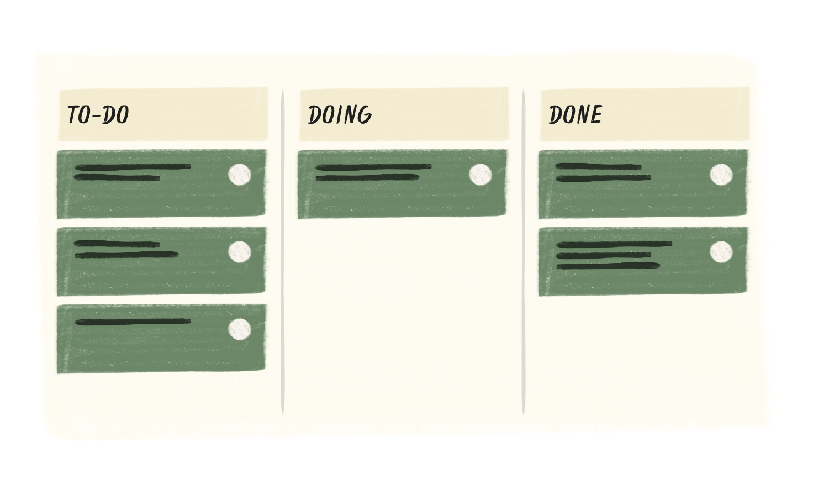
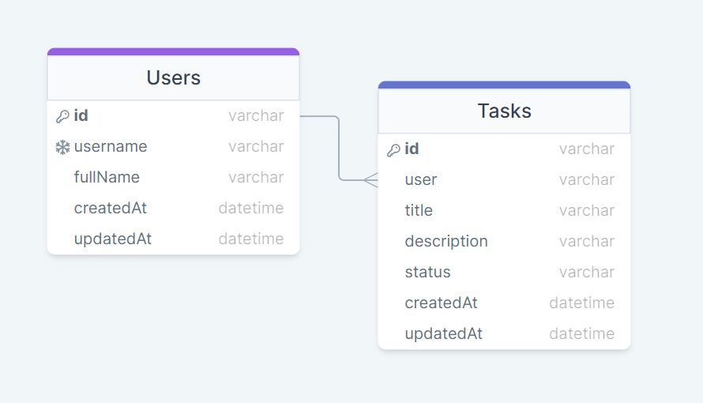

# Node - PROVA UF4 - Kanban TODO list
## DAW-MP07-UF4 - Serveis web. Pàgines dinàmiques interactives. Webs Híbrids.
**Objectiu**:

Crear una API per una aplicació que gestioni una llista de tasques per al mètode Kanban. 

El mètode Kanban és un flux de treball de productivitat visual, que proporciona una visió general de les tasques del projecte, de principi a fi. De manera que les diferents tasques es poden etiquetar (status) com a TODO, DOING i DONE. 

Aquesta aplicació suporta múltiples usuaris, d'aquests en volem saber el seu nom d'usuari i el nom complert. Cada tasca s'associa a un sol usuari i en guardarem el seu estat.

Tant dels usuaris com de les tasques en guardarem la seva data de creació (createdAt) modificació (upadatedAt). Seguint el següent diagrama de classes:

L'API es troba en una primera fase del desenvolupament concretament a la versió 0.1.

S'han de proporcionar les funcionalitats següents:

+ Crear rutes amb els següents métodes [CRUD]:
    + Afegir un usuari.
    + Afegir una tasca.
    + Obtenir tots els usuaris. 
    + Obtenir la informació d'una tasca específica. 
    + Modificar una tasca. 
    + Esborrar una tasca.
+ Una ruta que creuï informació de les dues taules:
    + Obtenir la llista completa de totes les tasques d'un usuari específic.
+ Afegir filtres a aquesta última ruta amb les tasques d'un usuari:
    + Filtrar les tasques d'un usuari en funció del seu estat (TODO, DOING, DONE).
    + Filtrar les tasques d'un usuari en funció de la data de creació d'aquestes (després d'una data en concret).
    + Combinar els filtres anteriors per obtenir una llista de tasques que compleixen ambdós filtres.
+ Eliminar un usuari. (Cal evitar-ne l'esborrat si aquest té tasques associades)

**A tenir en compte**:
1. L'examen es presentarà a la màquina isard facilitada pel professor. Podeu fer el desenvolupament en local i pujar-ho a a la màquina remota. 
1. Es pot fer servir el gestor de base de dades que es desitgi, es recomana fer servir [SQLite](https://www.sqlitetutorial.net/) (així no caldrà instal·lar res al servidor). Assegureu-vos que la base de dades estigui en blanc.
1. El professor posarà NOMÉS la comanda `npm start` al home (`/home/isard`) de la màquina isard. Assegureu-vos que el vostre codi estigui en aquella ruta. 
1. Caldrà seguir les bones pràctiques que hem vist a classe.

**No cal**:
1. No cal afegir caché a la nostra API.
1. No cal afegir metodes d'auntentificació/autorització.
1. No cal documentar l'API. Que això no vol dir que el codi no tingui comentaris.

**Avaluació:**
1. Fer un bon desplegament a la màquina Isard. [veure punts 1, 2, 3 anteriors] (1 punt)
1. Afegir un exemple d'ús de cada una de les funcionalitats (0.5 punts)
1. Implementar la funcionalitat esperada.
    1. Implementar les 6 rutes CRUD (3 punts)
    1. Implementar la ruta creuada (0.5 punts)
    1. Aplicar filtres a la ruta creuada (1 punt)
    1. Implementar l'eliminació d'un usuari de forma controlada (1 punt)
1. Definir les rutes amb la terminologia adequada seguint les bones pràctiques. (0.5 punts)    
1. Estructurar correctament el codi en les carpetes i fitxers que s'esperen. (0.5 punts)
1. Utilitzar noms de variables i funcions adequats a les bones pràctiques. (0.5 punts)
1. Respondre correctament les peticions, comprovar-ne les dades entrants i anonimitzar les IDs entrants. (1.5 punts)
---

#FpInfor #Daw #DawMp07 #DawMp07Uf04

---

###### Autor: Aniol Lidon 2022.12.02
###### [CC BY](https://creativecommons.org/licenses/by/4.0/) 